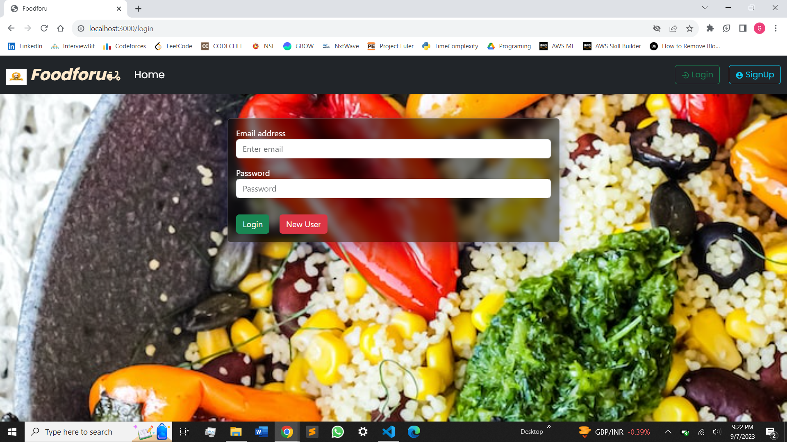

# foodforu - MERN app



## Table of Contents

- [Features](#features)
- [Technologies Used](#technologies-used)
- [Getting Started](#getting-started)
- [Installation](#installation)
- [Configuration](#configuration)

## Features

- **User Authentication**: Register, log in, and securely manage your account.
- **Explore the Menu**: Browse a diverse range of dishes with detailed descriptions and mouthwatering images.
- **Seamless Cart**: Add, edit, and remove items from your cart with ease.
- **Efficient Search**: Quickly find your favorite dishes or discover new ones.
- **Categorized Menu**: Organized menu items into categories for a user-friendly experience.
- **Express Checkout**: Effortlessly place and confirm orders with flexible payment options.


## Technologies Used

- **Frontend:**
  - React
  - WebSocket (for real-time communication)

- **Backend:**
  - Node.js
  - Express.js
  - MongoDB
  - Socket.io (for real-time chat)

## Getting Started

To run this chat application locally, you'll need to set up both the server and client components. Follow these steps to get started:

### Prerequisites

Make sure you have the following software installed on your machine:

- [Node.js](https://nodejs.org/)
- [MongoDB](https://www.mongodb.com/)

### Installation

1. **Clone the Repository:**

   Start by cloning this repository to your local machine. Open your terminal/command prompt and run the following command:

   ```bash
   git clone https://github.com/Puneeth03/foodforu.git
    ```
2. **Change to the Project Directory:**

    Navigate to the project directory:
    ```bash
    cd foodforu
    ```
3. **Install Dependencies:**

    Install the required dependencies for both the server and the client:
    ```bash
    cd backend
    npm install
    ```
    ```bash
    npm install
    ```
    
### Configuration:

  Before running the application, you may need to configure environment variables or set up a MongoDB database. Make sure to create a .env file in the server directory.
  The necessary env variable are port number, mongo_uri and jwt_secret.
  
  Running the Application:
  Now that you have the project set up, you can start the server and client to run the chat application locally:
  1. Start the Server:
     ```bash
     cd backend
     node index.js
     ```
     This will start the server on a specified port (e.g., http://localhost:5000).
  2. Start the Client:
     ```bash
     npm start
     ```
     This will start the React development server and open the food delivery application in your default web browser.


